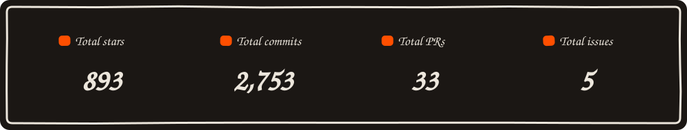

# Hi, I'm Sanyam.

CS junior at UW-Madison. Indian by passport, Emirati by upbringing, currently in Wisconsin.
I run my own servers in three cities and build the things I wish existed.

## Things I made

- **[AirPipe](https://github.com/Sanyam-G/Airpipe)**: encrypted file transfer between any two devices. Built because rsync hurts my feelings.
- **[Switch](https://github.com/Sanyam-G/switch)**: native macOS window switcher. ⌘Tab between windows, not apps.
- **[Drift](https://sanyamgarg.com)**: live multiplayer cursors on my homepage. You see other visitors move. Mildly unsettling, mostly delightful.
- **[Servers](https://servers.sanyamgarg.com)**: the rack tour. Three cities, two dozen services.

## Find me

[sanyamgarg.com](https://sanyamgarg.com) · [linkedin](https://linkedin.com/in/sanyam-g) · sanyam@sanyamgarg.com
